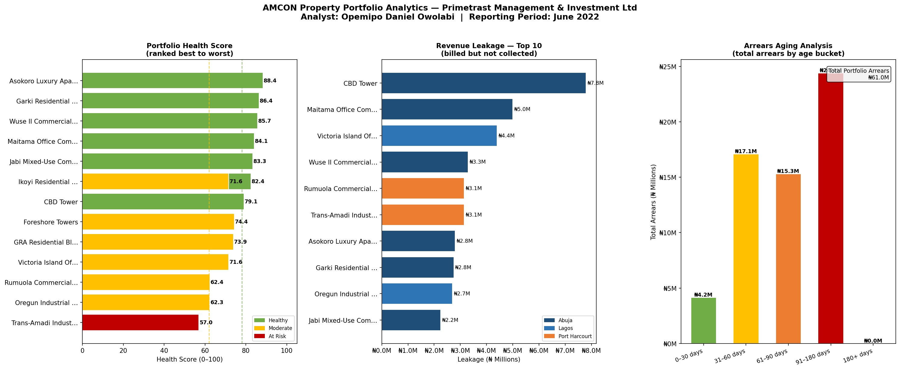
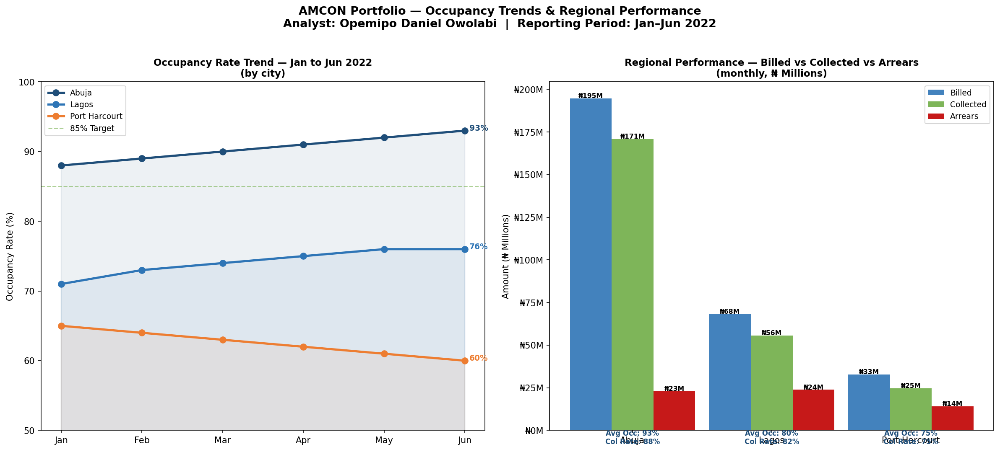

# AMCON Property Portfolio Analytics — Primetrast Management & Investment Ltd

**Portfolio Project 4** — Financial property analytics for AMCON-managed assets across Lagos, Abuja, and Port Harcourt, built during my time as a Data Analyst at Primetrast Management and Investment Ltd.

> Built by **Opemipo Daniel Owolabi** — Data Analyst | Python · SQL · Power BI · Tableau  
> Faro, Portugal | opemipoowolabi001@gmail.com

---

## Context

Primetrast Management and Investment Ltd managed a portfolio of properties on behalf of the **Asset Management Corporation of Nigeria (AMCON)** — the federal government agency responsible for resolving non-performing loans and managing recovered assets across Nigeria.

The portfolio spans 14 properties across Lagos, Abuja, and Port Harcourt — commercial office blocks, residential estates, industrial units, and mixed-use complexes.

---

## Business Problem

Management had no unified view of portfolio performance. Rent was being collected inconsistently, arrears were aging without escalation, and no one knew which properties deserved priority attention.

This project delivers five focused analyses in a single pipeline:

1. **Portfolio Health Scoring** — every property ranked by performance
2. **Revenue Leakage Analysis** — exact naira value of uncollected rent
3. **Arrears Aging Analysis** — who owes, how long, how much
4. **Occupancy Trend Analysis** — which cities are growing or declining
5. **Regional Performance** — Lagos vs Abuja vs Port Harcourt side by side

---

## Dashboard Preview




---

## Key Results

| Metric | Value |
|--------|-------|
| Total Properties | 14 |
| Monthly Portfolio Billed | N295.8 Million |
| Total Collected | N251.2 Million |
| Overall Collection Rate | 85.0% |
| Revenue Leakage (monthly) | N44.5 Million |
| Total Outstanding Arrears | N61.0 Million |
| Average Portfolio Occupancy | 84.3% |
| Best Performing Property | Asokoro Luxury Apartments, Abuja (Score: 88.4/100) |
| Critical Arrears (90+ days) | 4 properties — N24.4M at risk |

---

## Portfolio Health Score — Methodology

Each property is scored out of 100 using four weighted metrics:

| Metric | Weight | Logic |
|--------|--------|-------|
| Collection Rate | 50% | Higher collection = higher score |
| Occupancy Rate | 30% | Higher occupancy = higher score |
| Arrears Age | 10% | Older arrears = lower score |
| Maintenance Cost Ratio | 10% | Higher cost ratio = lower score |

Score thresholds: Healthy (78+), Moderate (62–77), At Risk (below 62)

---

## Key Findings

- **Abuja** is the strongest region — highest collection rate, highest occupancy, and growing month-on-month
- **Port Harcourt** occupancy declined from 65% to 60% over 6 months — requires strategic review
- **Trans-Amadi Industrial Units** (Port Harcourt) is the only At Risk property with 150 days of arrears and N6.3M outstanding
- **N36.5M** in arrears is still within a 90-day recovery window and should be prioritised immediately

---

## Recommendations

1. Escalate legal recovery on Trans-Amadi (150 days) and Oregun Industrial Complex (120 days)
2. Review Port Harcourt leasing strategy — occupancy declining consistently for 6 months
3. Prioritise Abuja portfolio for AMCON asset expansion — strongest performance metrics
4. Initiate structured repayment plans for the N36.5M recoverable within 90-day window

---

## How to Run

```bash
git clone https://github.com/opemipo-analytics/amcon-portfolio-analytics.git
cd amcon-portfolio-analytics

pip install pandas numpy matplotlib seaborn

python amcon_portfolio_analytics.py
```

---

## Tools and Technologies

| Tool | Purpose |
|------|---------|
| Python 3 | Core scripting |
| Pandas | Data modelling and aggregation |
| Matplotlib | Custom multi-panel dashboards |
| Seaborn | Visual styling |

---

## Skills Demonstrated

- Financial analytics — rent collection, arrears aging, revenue leakage
- Composite scoring — building a weighted health score across multiple KPIs
- Portfolio management thinking — translating property data into executive recommendations
- Multi-panel dashboard design — five analyses in two clean dashboard pages
- Real-world business context — AMCON is a real federal government agency in Nigeria

---

## Other Projects

| Project | Description |
|---------|-------------|
| [AEDC Marketer Performance](https://github.com/opemipo-analytics/AEDC-MARKETERS-ANALYTICS) | Python analysis of electricity marketer KPIs |
| [AEDC Revenue Forecasting ML](https://github.com/opemipo-analytics/aedc-revenue-forecasting) | Machine Learning revenue forecast — 99.8% accuracy |
| [AEDC Customer Segmentation](https://github.com/opemipo-analytics/aedc-customer-segmentation) | SQL and RFM customer segmentation |

---

*Built from real operational context during my time as a Data Analyst at Primetrast Management and Investment Ltd, managing AMCON-recovered property assets across Nigeria.*
