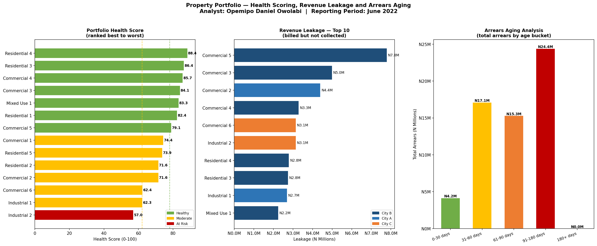
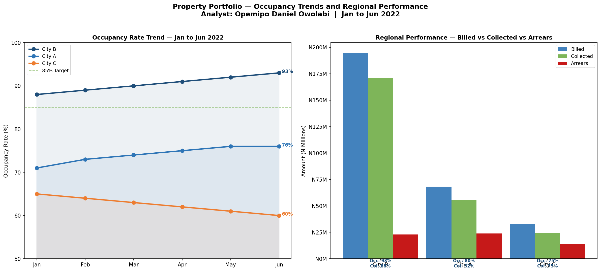

# Property Portfolio Analytics — Financial Performance Analysis

**Portfolio Project 4** — Financial analytics for a government-managed property portfolio across three cities, covering revenue leakage, arrears aging, occupancy trends, health scoring and regional comparison.

> Built by **Opemipo Daniel Owolabi** — Data Analyst | Python · SQL · Power BI · Tableau  
> Faro, Portugal | opemipoowolabi001@gmail.com

---

## Note on Data

All company names, client names, locations and identifying information have been anonymised in this public version to protect client confidentiality. Properties are referred to generically by type and number. Cities are referred to as City A, City B and City C. The analytical approach and methodology reflect real work conducted during professional employment in the property management sector.

---

## Business Problem

A property management company managed a portfolio of assets on behalf of a government asset management agency. Management had no unified view of portfolio health. Rent was being collected inconsistently, arrears were aging without escalation, and no one knew which properties deserved priority attention.

This project delivers five focused analyses:

1. Portfolio Health Scoring — every property ranked by performance
2. Revenue Leakage Analysis — exact value of uncollected rent
3. Arrears Aging Analysis — who owes, how long, how much
4. Occupancy Trend Analysis — which cities are growing or declining
5. Regional Performance — City A vs City B vs City C side by side

---

## Dashboard Preview




---

## Key Results

| Metric | Value |
|--------|-------|
| Total Properties | 14 |
| Monthly Portfolio Billed | N295.8 Million |
| Total Collected | N251.2 Million |
| Overall Collection Rate | 85.0% |
| Revenue Leakage (monthly) | N44.5 Million |
| Total Outstanding Arrears | N61.0 Million |
| Properties At Risk | 1 |

---

## Portfolio Health Score — Methodology

Each property is scored out of 100 using four weighted metrics:

| Metric | Weight | Logic |
|--------|--------|-------|
| Collection Rate | 50% | Higher collection = higher score |
| Occupancy Rate | 30% | Higher occupancy = higher score |
| Arrears Age | 10% | Older arrears = lower score |
| Maintenance Cost Ratio | 10% | Higher cost ratio = lower score |

Score thresholds: Healthy (78+), Moderate (62 to 77), At Risk (below 62)

---

## Project Structure

```
project4/
├── portfolio_analytics.py          # Main analysis script
├── portfolio_dashboard_page1.png   # Health scoring, leakage, arrears aging
├── portfolio_dashboard_page2.png   # Occupancy trends, regional comparison
└── README.md                       # This file
```

---

## How to Run

```bash
git clone https://github.com/opemipo-analytics/amcon-portfolio-analytics.git
cd amcon-portfolio-analytics

pip install pandas numpy matplotlib seaborn

python portfolio_analytics.py
```

---

## Tools and Technologies

| Tool | Purpose |
|------|---------|
| Python 3 | Core scripting |
| Pandas | Data modelling and aggregation |
| Matplotlib | Custom multi-panel dashboards |

---

## Skills Demonstrated

- Financial analytics — rent collection, arrears aging, revenue leakage
- Composite scoring — building a weighted health score across multiple KPIs
- Portfolio management — translating property data into executive recommendations
- Multi-panel dashboard design — five analyses across two dashboard pages
- Cohort analysis — tracking occupancy trends across regions over 6 months

---

## Other Projects

| Project | Description |
|---------|-------------|
| [Marketer Performance Analysis](https://github.com/opemipo-analytics/AEDC-MARKETERS-ANALYTICS) | Python analysis of field marketer KPIs |
| [Revenue Forecasting ML](https://github.com/opemipo-analytics/aedc-revenue-forecasting) | Machine learning revenue forecast |
| [Customer Segmentation](https://github.com/opemipo-analytics/aedc-customer-segmentation) | SQL and RFM customer segmentation |
| [Smart Meter Analytics](https://github.com/opemipo-analytics/smart-meter-analytics) | IoT smart meter revenue intelligence |

---

*Built from real operational experience as a Data Analyst in the property management sector.*
